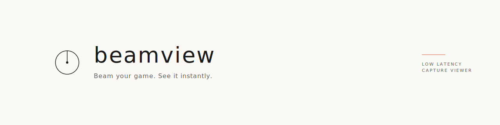

<div align="center">
  
</div>

<p align="center">
  <em>Beam your game. See it instantly.</em>
</p>

<p align="center">
  Low-latency HDMI capture card viewer for desktop gamers — built with Tauri v2 and Svelte 5.
</p>

---

## Status

🚧 **Work in progress — Phase 1 (MVP).** Not ready for use yet.

Beamview is a side project focused on replacing OBS/QuickTime for the narrow use case of "playing a console game through a capture card on your Mac." Phase 1 targets macOS only, end-to-end latency under 100 ms, and a minimal UI that stays out of your way.

## Requirements

- macOS 13 or newer
- [Rust](https://rustup.rs/) stable (MSRV 1.77)
- Node.js 20 LTS or newer
- [pnpm](https://pnpm.io/) 9 or newer
- A USB video capture card exposed as a UVC/UAC device (e.g. UGREEN 15389, Elgato HD60 S+, AVerMedia Live Gamer)

## Develop

```bash
pnpm install
pnpm tauri dev
```

Vite serves the frontend at `http://localhost:1420`. Tauri launches a native window that loads it.

## Scripts

| Command | Purpose |
| --- | --- |
| `pnpm dev` | Vite dev server only |
| `pnpm tauri dev` | Full app (Rust + Vite with hot reload) |
| `pnpm build` | Production frontend build |
| `pnpm tauri build` | Bundled `.dmg` (macOS) |
| `pnpm check` | `svelte-check` TypeScript + Svelte validation |

## Project layout

```
beamview/
├── assets/              # Brand master files (SVG + PNG logos, banners)
├── src/                 # Svelte + TypeScript frontend
├── src-tauri/           # Rust backend (Tauri shell)
│   ├── Info.plist       # Camera + microphone usage descriptions (macOS)
│   └── src/             # Rust sources
├── static/              # Copied as-is to the frontend bundle
└── index.html           # Vite entry
```

## Brand

Minimal Japanese aesthetic — palette is Sumi ink, Stone, Mist, Paper, and Vermilion accent. Brand assets live under `assets/`.

## License

[MIT](LICENSE) © 2026 Jiraphat
